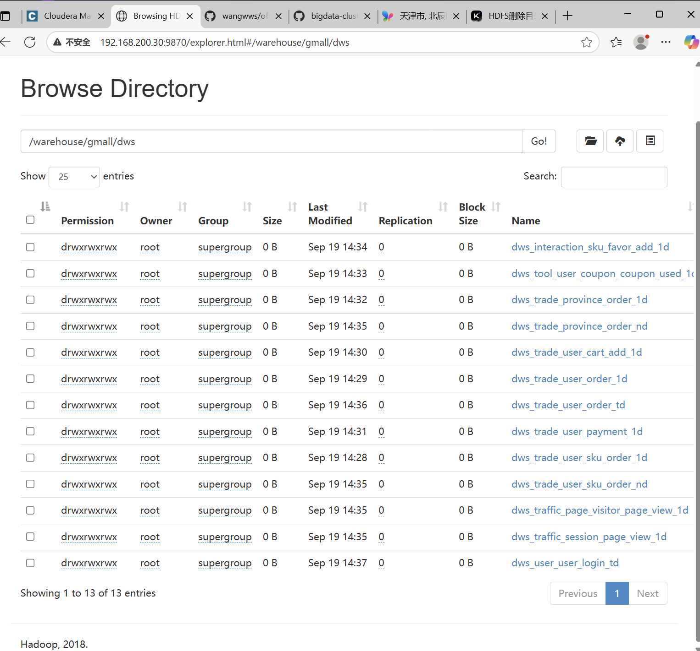

昨天到了dwd层今天我把dws和ads层的数据写完并执行成功,显示数据
>
> 
>
> 

通过官网链接地址下载成功
>

配置系统环境变量以及搭好
>

通过终端的执行命令来查看是否成功,我已经显示成功了
>

验证配置成功的效果如果
>

更换国内源并且也查看了查看当前源通过cmd执行conda config --show命令就OK了
>
在idea中创建 python conda 项目已经创建好了如下
>

